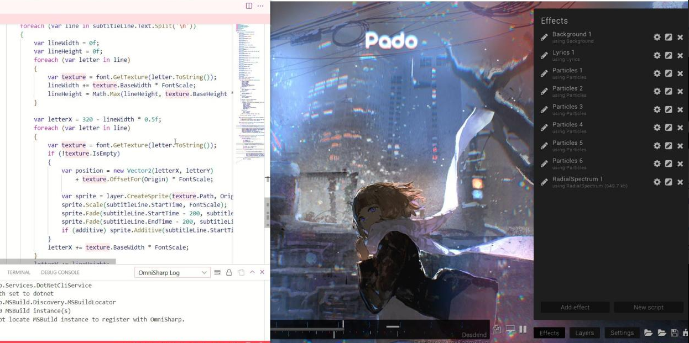

# Storybrew

## Storybrew

เป็นโปรแกรมที่ทำโดย [Damnae](https://osu.ppy.sh/users/989377) โดยเริ่มเปิดให้ใช้ตั้งแต่ 2016 และยังคอยอัฟเดตเรื่อยๆ ตั้งแต่นั้นจนถึงปัจจุบัน.
Storybrew คือโปรแกรมที่ช่วยในการทำ Storyboard สำหรับคนที่ไม่ค่อยถนัดการทำ Storyboard ในเกมเท่าไหร่ *(ฉันแล้วคนนึง)* แล้วบางครั้งบางอย่างในการทำ Storyboard ในแบบธรรมดานั้นก็ อาจจะทำไม่ได้เหมือน Storybrew ด้วย

## วิธีการใช้
Storybrew นั้นหากเทียบกับโปรแกรมตัวช่วยอื่นๆ storybrew จะเป็นโปรแกรมที่ยืดหยุ่นมากๆ. เป็นโปรแกรมที่พูดตามตรงเลยว่าโหดไม่โหดนั้นขึ้นอยู่กับผู้ใช้เป็นอย่างมาก แต่อยากจะใช้ง่ายๆก็มี kits แบบเบื่องต้นเข้าใจง่่ายๆให้

## script
script ในที่นี้จะหมายถึง Effect ที่ storybrew แถมมาให้พร้อมกับที่โหลดมา.
 จะมีทั้งหมด 10 effect ในปัจจุบัน(21 jan 2023)
โดยแต่ละอันจะมีวิธการและผลลัพคร่าวๆดังนี้

### Background
จะเป็น Script ที่จะใส่ ภาพพื่นหลังให้กับเรา

#### BackgroundPath
เป็นส่วนที่จะกำหนดว่าเราจะเอาส่วนไหนในในโฟลร์ดอร์เพลงนำมาใช้ ปกติแล้วหากไม่ได้ใส่ตัว Script จะนำ Background ที่ใช้ในเกมมาใช้ทันทีเลย

#### StartTime
จะกำหนดการเริ่มของช่วงเวลาของตัว script

#### EndTime
ก็กำหนดช่วงเวลาจบของตัว Script

#### Opacity
จะกำหนดความโปรงใสของตัว Sprite จะเริ่มตั้งแค่ 0(0% ไม่เห็นเลย) -> 1 (100% เห็นไม่โปรงใสเลย)

### HitobjectHighlight

### ImportOsb

### Jigoku

### Lyrics

### Karaoke

### Particles

### Spectrum

### RadialSpectrum

### Tetris
