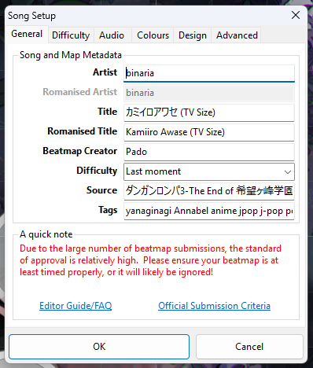
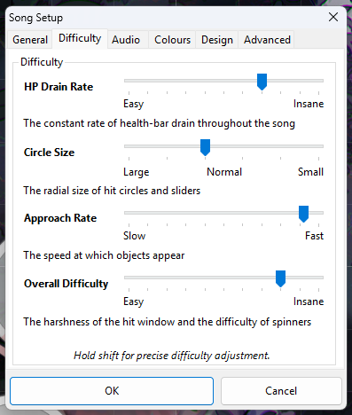
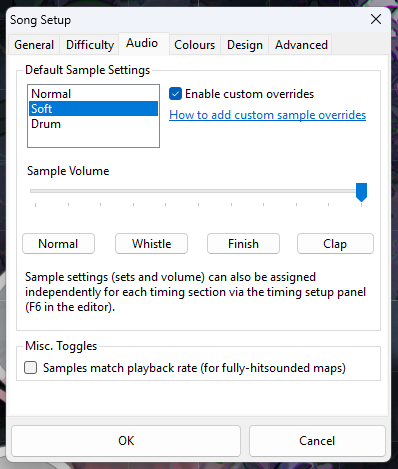
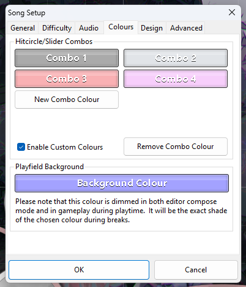
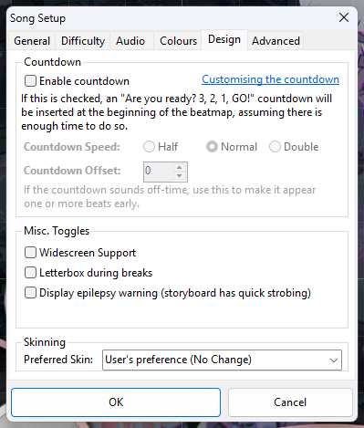
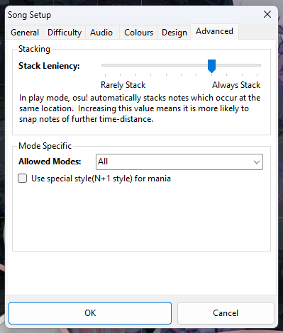

# ตั้งค่า

## Song Setup

### General

- **Artist:** ชื่อศิลปินตามภาษาต้นฉบับ เช่น ญี่ปุ่น, จีน เป็นต้น
- **Romanised Artist:** ชื่อศิลปินที่เขียนเป็นภาษาอังกฤษ
- **Title:** ชื่อเพลงตามภาษาต้นฉบับ
- **Romanised Title:** ชื่อเพลงที่เขียนเป็นภาษาอังกฤษ
- **Beatmap Creator:** ชื่อผู้สร้างแมพ (ตรงนี้ควรจะเป็นเราอยู่แล้ว)
- **Difficulty:** ชื่อระดับความยากทของแมพนี้ เช่น Easy, Normal, Hard, Insane, Expert แต่ว่าจะตั้งอะไรก็ได้
- **Source:** ที่มาของเพลงนั้นๆ (อนิเมะ, หนัง, เกม)
- **Tags:** คีย์เวิร์ดเพิ่มเติมที่ช่วยให้ผู้เล่นหาแมพได้สะดวกขึ้น เช่น แนวเพลง, ชื่ออัลบั้ม, ชื่อคนที่ร่วมกันทำแมพ

### Difficulty

- **HP Drain Rate:** ความเร็วของ HP ที่ลดในขณะเล่นหรือ miss (ยิ่งมาก เลือดยิ่งลดแรง)
- **Circle Size:** ขนาดของโน้ตต่างๆ (ยิ่งมาก โน้ตยิ่งเล็ก)
- **Approach Rate:** ความไวของโน้ตที่โผล่ออกมา (ยิ่งมาก โน้ตยิ่งมาไว)
- **Overall Difficulty:** ความยากของช่องเวลาในการกดแต่ละโน้ตและ spinner (ยิ่งมาก ยิ่งต้องกดให้แม่นขึ้นเพื่อที่จะได้ 300)

### Audio

:::info
mapper ส่วนมากไม่นิยมใช้เมนูนี้แล้ว และจะไปตั้งในส่วนของ timing points มากกว่า 
แนะนำให้ไปดูในส่วนของ [การ hitsound พื้นฐาน](/hitsound/base.md)
:::

- **Default Sample Settings:** ตั้งค่าเริ่มต้นว่าจะให้โน้ตแต่ละตัวใช้ sample อะไร (Normal, Soft, Drum)
- **Enable custom overrides:** ตั้งให้สามารถนำไฟล์เสียงอื่นมาตั้งเป็น hitsound sample ได้
- **Sample Volume:** ระดับเสียงของ sample
- **Samples match playback rate:** ตั้งให้ความเร็วและ pitch ของ hitsound sample ปรับเปลี่ยนไปตามความเร็วของเพลง

### Colours

- ในหน้านี้เราสามารถตั้งสีของ combo โดยเฉพาะได้ โดยจะตั้งได้สูงสุด 8 สี
- อย่าลืมติ๊กถูกที่ปุ่ม **Enable Custom Colours**

### Design

- **Enable countdown:** แสดงเวลานับถอยหลัง 3, 2, 1 ก่อนโน้ตแรก
- **Widescreen support:** ปรับให้พื้นหลังแสดงผลแบบ 16:9 แนะนำสำหรับคนที่ทำ storyboard แบบจอกว้าง แต่ถ้าใครไม่ทำก็ไม่จำเป็นต้องไปติ๊ก
- **Letterbox during breaks:** เพิ่มแถบดำที่ขอบบนล่างจอในช่วงเบรก
- **Dispaly epilepsy warning:** เพิ่มคำเตือนก่อนเล่นหาก video/storyboard มีภาพ แสงสีที่รวดเร็ว

### Advanced

- **Stack Leniency:** ปรับการ stack อัมโนมัติของโน้ตในระหว่างการเล่น ยิ่งมีค่ามาก โน้ตที่อยู่ช่วงเวลาไกลออกไปแต่อยู่ตำแหน่งเดียวกันก็จะมีโอกาส stack กันมากขึ้น
- **Allowed Modes:** โหมดของแมพนี้ (All คือโหมด Standard)
