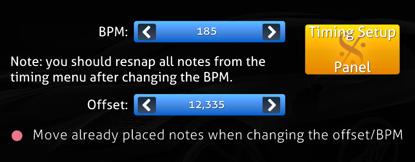
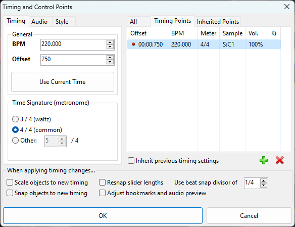
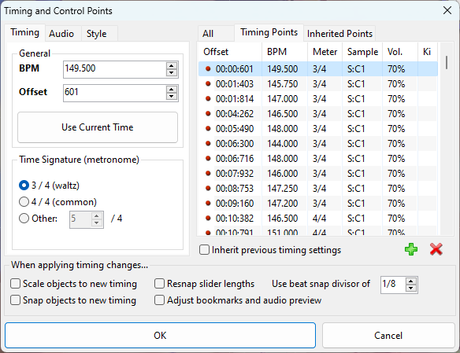

import Tabs from '@theme/Tabs';
import TabItem from '@theme/TabItem';

:::danger WORK IN PROGRESS
หน้านี้กำลังอยู่ในระหว่างการสร้าง และยังไม่เสร็จสมบูรณ์ 100%
:::
# Timing
เราจะมาพูดถึงการตั้ง timing ก่อนที่จะทำแมพ หากเราไม่ถูก แมพก็จะไม่ตรงจังหวะ แต่ก่อนอื่นมึงเอา MP3 มาจากไหนก่อน

## การวาง Timing Points
Timing จะมี 2 ส่วนสำคัญๆที่จะชิปหายแน่นอนถ้าทำส่วนนี้ไม่ดี ได้แก่

- BPM จะเป็นตัวกำหนดว่าเพลงนี้มีความเร็วเท่าไหร่จะเห็นได้ในทุกเกมเพราะมันคือหัวใจหลักของเพลงเลย หลายๆเพลงจะมี BPM ที่คงที่ในที่นี้จะขอแทนที่ว่า **BPM เดียว** และอีกส่วนคือเพลงที่มี BPM ไม่คงที่ในที่นี้จะของเรียกว่า **หลาย BPM** นะครับเข้าใจง่ายดี
- offset พอเราได้จังหวะ BPM ที่ถูกต้องแล้วแต่ถึงยังไงตัวเมก็ยังไม่รู้ว่าตัวไฟล์ที่เราเอามานั้นมันเริ่มพร้อมกับตัว BPM ที่เราตั้งใว้ในเหมไหม และนี้คือหน้าที่ของ Offset ที่ถ้าหากจังหวะในเกมเริ่มก่อนหรือหลังของ จังหวะจริงของเพลงตัวนี้ก็จะเป็นตัวที่ปรับให้มันเริ่มพร้อมกันได้
ทั้งสองส่วนนี้จะทำงานสอดคล้องกัน ถ้าจะให้แนะนำส่วนตัวจะปรับ offset ให้ตรงกับเสียงแรกก่อนพวกกลองหรืออะไรพวกนี้หลังจากนั้นให้ปรับ BPM ตามทีหลัง

<Tabs>
  <TabItem value="apple" label="BPM เดียว" default>
    
    
ส่วนใหญรูปแบบนี้จะเป็นได้ทั่วไปเข่นเพลงจำพวก j-pop/j-rock/Electronic ต่างๆเพลงแนวนี้แนะนำสำหรับเริ่มทำแมพใหม่ๆ เพราะจะไม่ต้องมานั้งปวดหัวกับ อะไรพวกนี้เพราะผมบอกใด้เลยว่า BPM เดียวจะประหยัดเวลากับการนั้งหา Timing เป็นอย่างมาก

  </TabItem>
  <TabItem value="orange" label="หลาย BPM">
    
    
ถ้าจะนิยามว่าเพลงทำยากๆเป็นยังไง ก็จะบอกเลยว่าเป็นหย่างงี้เลยถ้าผมพูดใน BPM เดี้ยวมันดียังไงอันนี้ก็เหมือนกันแต่ตรงกัยข้ามเพราะนี้จะไม่ญาติดีกับคุณเลยซักนิด เพลงที่มี bpm จำพวกนี้จะเป็นพวกเพลงที่เป็น ่jazz/Live concert ทั้งหลาย

  </TabItem>
</Tabs>
